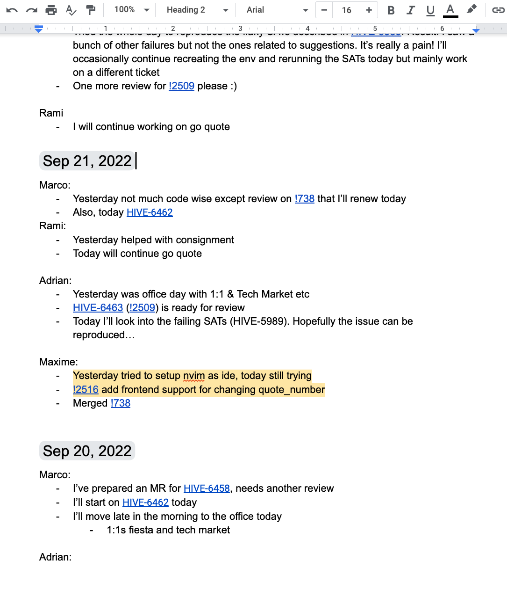

# Remote journal
Or how I learned to work in a pijiama

## How many are working remotely?

## How many are doing a daily meeting with a video call?

## How many find it useful?

## The Goal
* Proposing an alternative and some argumentation for replacing remote daily
* Tickling your imagination

Work with eXtreme Programming for 8 years

The daily stand-up was never a chore (and I actually liked it)

Note: for a good chunk of that period we had no slack, no individual working stations and, imagine, no Jira

* It's good for synching up with the other team members
* It's useful for deciding the pairs before starting the day
* It helps in checking the team's pulse

Note: for example we can avoid having two people working on the same thing or solving the same problem twice

Then the pandemic came and the daily became remote
* Video call
* Daily event in a calendar
* You know the rest...

Note: Little video boxes, embarassed small-talk

### Partly it felt useless...
* Communication already happened on Slack, before and after the daily
* No sharing, just say SOMETHING and go away
* Communication without human connection

### ...and partly it felt punishing
* Wait for someone who wasn't on time
* Too long, too short (and we discussed it during retro)
* People pay attention to what they care for
* Flow had to be interrupted for attending

Note: and flow is a quite valuable currency for an engineer

### Working in a remote organization
* Communication is more structured and knowledge needs to be organized better
* Tendency to isolation
* People have their own habits and timing (and that's awesome)

Note: communication needs to be taken seriously

Working remotely and asynchronous communication is like P&J

Note: remote work and asynchronous communication is like peanut butter and jelly

## Introducing the Remote Journal

A shared document that the team members compile daily, sometime in the morning
* Everyone gives a brief description of what happened yesterday
* What will do today
* Any blocker or anything else might pass by their mind

## Cool because
* Doesn't interrupt the flow
* Can be read anytime, even by people who cannot attend the daily
* Can be written anytime in the morning, respecting individuals' needs

Note: but there are also some advantages over a simple chat channel

## Even cooler because
* Can be backtracked, even months before
    * Helps with retrospectives
    * Helps with recovering info in the future
* Can be searched
* Can be shared with anyone

### Wrapping up
* Improvement of work happiness and satisfaction of the team.
* Hopefully I've inspired some of you to look for some other recurring meeting/ceremony that is waiting to be converted into asynchronous

## This presentation could have been an email

- https://about.gitlab.com/company/culture/all-remote/guide/
- https://www.marcopolita.me